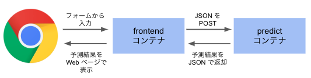

GKE(Google Kubernetes Engine) 上でアヤメの品種判定を行う Web アプリの、非公式チュートリアルです。

# アプリケーションの概要

アプリの概要は次の図の通りです。



### コンテナの役割

##### frontend コンテナ

Web フロントになっています。次の通り動作します。

1. フォームからアヤメのガクの長さ、幅、花弁の長さ、幅をフォームから入力
1. バックエンドのコンテナに JSON で POST します。
1. バックエンドコンテナから JSON を受け取り、結果の HTML を生成

##### predict コンテナ

バックエンドで動作するコンテナ。機械学習の予測結果を返却する API サーバのです。次の通り動作します。

1. JSON を受け取ります。
1. 受け取った JSON から、アヤメの品種を予測します。
1. 予測結果を JSON で返却します。

### チュートリアルの流れ

このチュートリアルでは以下の流れで作業を行います。

1. アヤメの品種を予測するモデルを作成
1. frontend, predict コンテナイメージをビルド
1. Docker イメージを Container Registry に push
1. Kubernetes 環境の構築

まずは、このレポジトリをクローンしてください。

```
$ git clone https://github.com/ao-log/gke-iris-tutorial
```

# アヤメの品種を予測するモデルを作成

機械学習で訓練を行うためのイメージをビルドします。

##### イメージをビルド

```shell
$ docker build -t train:v1.0 train
```

##### モデルの作成

先ほど作成したイメージからコンテナを起動し、訓練します。作成したモデルは model ディレクトリに保存します。

```shell
# モデル用のディレクトリを作成
$ mkdir model

# 学習を実行し、モデルを作成
$ docker run --rm -v `pwd`/model:/workspace/model train:v1.0 python train.py
```

# front, predict コンテナイメージをビルド

### predict コンテナ

##### イメージをビルド

```shell
# モデルをコピー
$ cp model/iris.joblib predict/src/model/

# ビルド
$ docker build -t predict:v1.0 predict
```

##### 予測の動作確認

コンテナを起動します。

```
$ docker run --rm -d --name predict -p 8080:8081 predict:v1.0
```

JSON を POST して、得られる結果を確認します。

```shell
$ curl -H "Content-Type: application/json" --data '{"data":[[6, 3, 5, 2]]}' http://localhost:8080/predict
{"predicted_class":[2]}

$ $ curl -H "Content-Type: application/json" --data '{"data":[[5.2, 3.5, 1.5, 2.1]]}' http://localhost:8080/predict
{"predicted_class":[0]}
```

### frontend コンテナを作成

##### イメージをビルド

```shell
$ docker build -t frontend:v1.0 frontend
```

# Docker イメージを Container Registry に push

以降の作業の為に、プロジェクト ID を格納する環境変数を設定します。

```
$ export PROJECT_ID=$(gcloud config get-value project)
```

所定の命名規則でタグ付けします。

```
$ docker tag frontend:v1.0 gcr.io/$PROJECT_ID/frontend:v1.0
$ docker tag predict:v1.0 gcr.io/$PROJECT_ID/predict:v1.0
```

コンテナを push します。
「Google Container Registry API」を有効化していない場合は、有効化する URL が表示されます。有効化していないと push 出来ません。

```
$ gcloud docker -- push gcr.io/$PROJECT_ID/frontend:v1.0
$ gcloud docker -- push gcr.io/$PROJECT_ID/predict:v1.0
```

# Kubernetes 環境の構築

### Kubernetes クラスタの作成

Kubernetes クラスタを作成します。
「Kubernetes Engine API」を有効化していない場合は、有効化する URL が表示されます。有効化していないとクラスタを作成できません。

```
$ gcloud container clusters create iris-cluster \
  --zone us-central1-a \
  --num-nodes 2 \
  --preemptible
```

kubectl コマンドを扱えるようにするため、クレデンシャルを取得します。

```
$ gcloud container clusters get-credentials iris-cluster --zone us-central1-a
```

先ほど作成したクラスタを構成するノードの稼働状況を確認します。

```
$ kubectl get nodes
NAME                                          STATUS    ROLES     AGE       VERSION
gke-iris-cluster-default-pool-dbde08eb-bfv6   Ready     <none>    3m        v1.9.7-gke.6
gke-iris-cluster-default-pool-dbde08eb-twkv   Ready     <none>    3m        v1.9.7-gke.6
```

### Pod のデプロイ

Pod をデプロイする前に、Deployment のファイルのプロジェクト ID の部分を書き換えます。

```
$ sed -i "s/<PROJECT_ID>/$PROJECT_ID/" config/frontend-deployment.yaml
$ sed -i "s/<PROJECT_ID>/$PROJECT_ID/" config/backend-deployment.yaml
```

次のコマンドで Pod をデプロイします。

```
$ kubectl apply -f kube-config/predict-deployment.yaml
$ kubectl apply -f kube-config/frontend-deployment.yaml
```

Pod の稼働状況は次のコマンドで確認します。

```
$ kubectl get pods
```

### Service の適用

次のコマンドでサービスを適用します。

```
$ kubectl apply -f kube-config/predict-service.yaml
$ kubectl apply -f kube-config/frontend-service.yaml
```

サービスの適用状況は次のコマンドで確認します。

```
$ kubectl get services
```

frontend-service の EXTERNAL-IP がアサインされたらアクセスします。次のページが表示されていたら成功です。


### 後片付け

次のコマンドで各リソースを削除します。

```shell
# Service
$ kubectl delete service frontend-service
$ kubectl delete service predict-service

# Deployment
$ kubectl delete deployment frontend-node
$ kubectl delete deployment predict-node

# クラスタ
$ gcloud container clusters delete iris-cluster --zone us-central1-a
```

また、プロジェクトを削除することで、全リソースを確実に削除できます。
